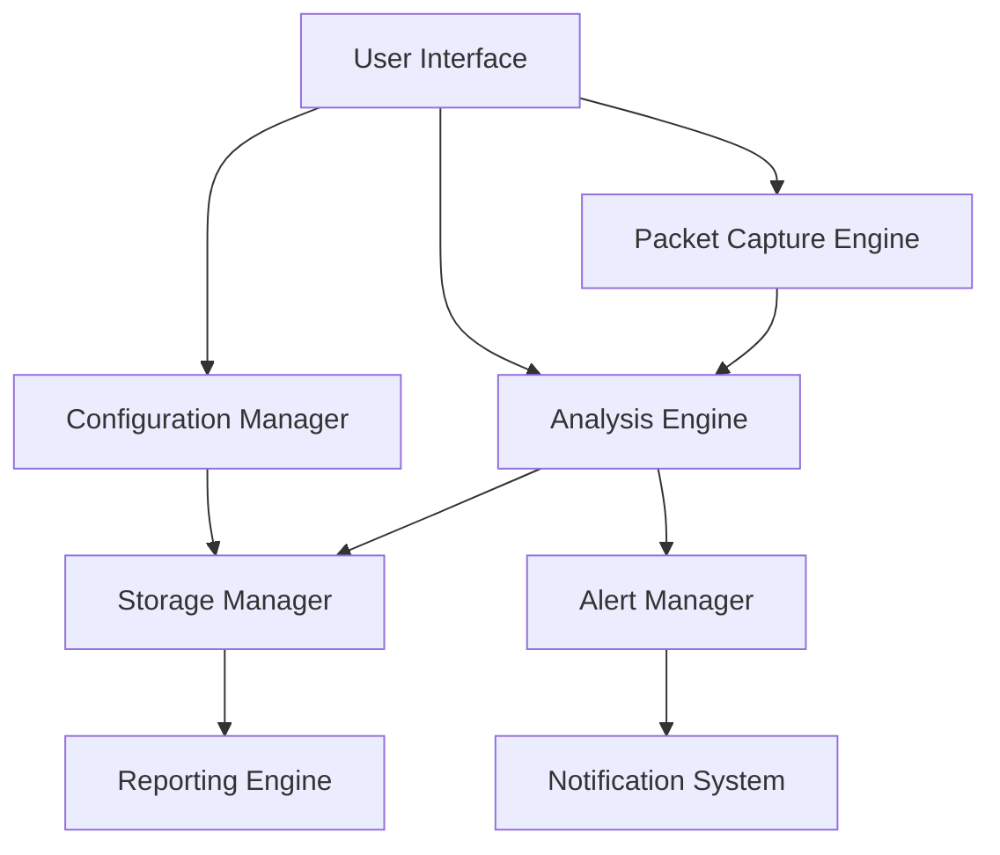
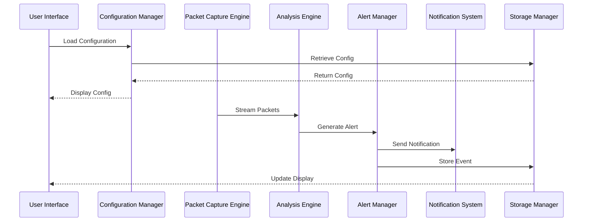
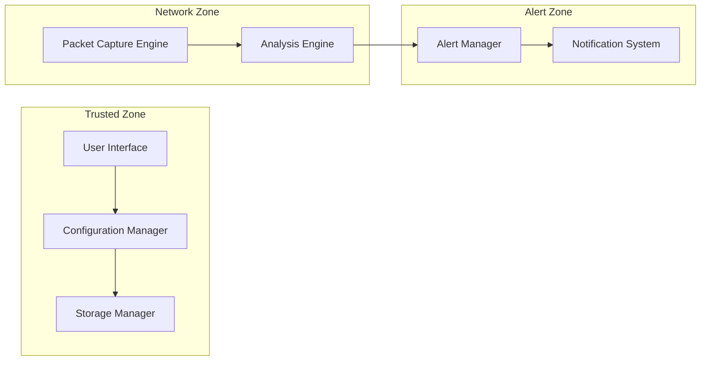
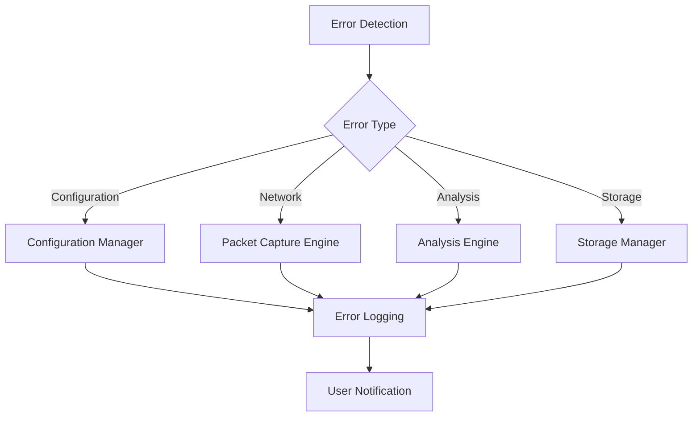

# ARPGuard Component Interactions

## System Overview

## Core Components

### 1. User Interface
- **Interactions**:
  - Receives user commands and configuration
  - Displays real-time monitoring data
  - Shows alerts and reports
- **Dependencies**:
  - Configuration Manager
  - Analysis Engine
  - Alert Manager

### 2. Configuration Manager
- **Interactions**:
  - Loads/saves configuration files
  - Validates configuration settings
  - Manages runtime configuration
- **Dependencies**:
  - Storage Manager
  - User Interface

### 3. Packet Capture Engine
- **Interactions**:
  - Captures network packets
  - Filters relevant ARP traffic
  - Forwards packets to Analysis Engine
- **Dependencies**:
  - Network Interface
  - Analysis Engine

### 4. Analysis Engine
- **Interactions**:
  - Processes captured packets
  - Detects ARP spoofing patterns
  - Generates security events
- **Dependencies**:
  - Packet Capture Engine
  - Alert Manager
  - Storage Manager

### 5. Storage Manager
- **Interactions**:
  - Stores configuration data
  - Maintains event logs
  - Manages historical data
- **Dependencies**:
  - File System
  - Database

### 6. Alert Manager
- **Interactions**:
  - Processes security events
  - Determines alert severity
  - Triggers notifications
- **Dependencies**:
  - Analysis Engine
  - Notification System

### 7. Notification System
- **Interactions**:
  - Sends alerts via configured channels
  - Manages notification templates
  - Tracks notification status
- **Dependencies**:
  - Alert Manager
  - External Services (Email, SMS, etc.)

### 8. Reporting Engine
- **Interactions**:
  - Generates security reports
  - Creates compliance documentation
  - Produces performance metrics
- **Dependencies**:
  - Storage Manager
  - User Interface

## Data Flow

## Security Boundaries

## Performance Considerations

1. **Packet Processing Pipeline**
   - Packet Capture → Analysis → Storage
   - Parallel processing for high throughput
   - Memory-efficient buffering

2. **Storage Optimization**
   - Compressed event storage
   - Efficient indexing
   - Automated cleanup

3. **Alert Processing**
   - Priority-based queue
   - Rate limiting
   - Batch processing

## Error Handling

## Integration Points

1. **External Systems**
   - SIEM Integration
   - Ticketing Systems
   - Monitoring Tools

2. **API Endpoints**
   - REST API for configuration
   - WebSocket for real-time updates
   - File export endpoints

3. **Data Formats**
   - JSON for configuration
   - CSV for reports
   - Syslog for events 