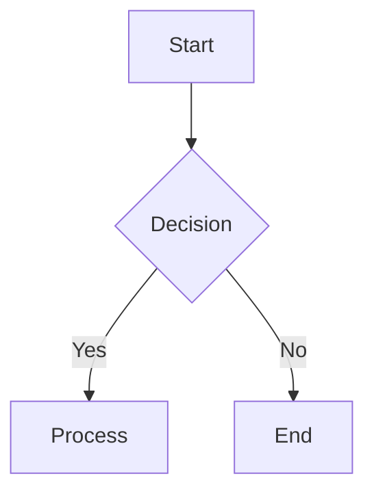

# Documentation Guidelines

## Writing Style

### General Principles
- Use clear, concise language
- Write in active voice
- Be consistent in terminology
- Use present tense
- Avoid jargon unless necessary
- Explain acronyms on first use

### Technical Writing
- Be precise and accurate
- Include code examples
- Document edge cases
- Explain error conditions
- Provide troubleshooting steps

## Documentation Structure

### File Organization
```
docs/
├── api/              # API documentation
├── guides/           # How-to guides
├── reference/        # Technical reference
├── tutorials/        # Step-by-step tutorials
└── user_manual/      # User documentation
```

### Document Structure
1. Title and metadata
2. Overview
3. Prerequisites
4. Main content
5. Examples
6. Troubleshooting
7. References

## Code Documentation

### Python Docstrings
```python
def function_name(param1: type, param2: type) -> return_type:
    """One-line description.
    
    Detailed description if needed.
    
    Args:
        param1: Description of param1
        param2: Description of param2
        
    Returns:
        Description of return value
        
    Raises:
        ExceptionType: Description of when this exception is raised
        
    Examples:
        >>> function_name(value1, value2)
        result
    """
```

### Class Documentation
```python
class ClassName:
    """Class description.
    
    Attributes:
        attr1: Description of attr1
        attr2: Description of attr2
    """
```

## Markdown Formatting

### Headers
```markdown
# Level 1
## Level 2
### Level 3
```

### Lists
```markdown
- Bullet point
  1. Numbered item
  2. Another item
```

### Code Blocks
````markdown
```python
def example():
    pass
```
````

### Tables
```markdown
| Header 1 | Header 2 |
|----------|----------|
| Cell 1   | Cell 2   |
```

## Diagrams

### Mermaid


## Version Control

### Commit Messages
```
docs: update component documentation
docs: fix typo in user guide
docs: add new API reference
```

### Branch Naming
```
docs/update-guide
docs/fix-typo
docs/add-api
```

## Review Process

### Technical Review
- Accuracy of technical content
- Code examples
- API documentation
- Configuration options

### Editorial Review
- Grammar and spelling
- Style consistency
- Clarity
- Readability

### User Experience Review
- Navigation
- Searchability
- Accessibility
- Mobile responsiveness

## Maintenance

### Regular Updates
- Weekly content review
- Monthly structure review
- Quarterly comprehensive review

### Deprecation
- Mark deprecated features
- Provide migration guides
- Update version compatibility

## Tools and Automation

### Documentation Tools
- Sphinx for API docs
- Markdown for content
- Mermaid for diagrams
- Prettier for formatting

### Automated Checks
- Spelling
- Links
- Code examples
- Structure validation

## Best Practices

### Writing
- Keep it simple
- Be consistent
- Use examples
- Include screenshots
- Provide context

### Organization
- Logical structure
- Clear navigation
- Cross-referencing
- Version control

### Maintenance
- Regular updates
- Version tracking
- Change logs
- Feedback collection 