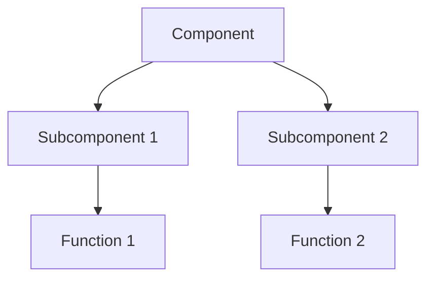

# Component Name

## Overview
Brief description of the component's purpose and functionality.

## Features
- Feature 1
- Feature 2
- Feature 3

## Architecture


## API Reference

### Class: `ClassName`
```python
class ClassName:
    def method_name(self, param1: type, param2: type) -> return_type:
        """Method description.
        
        Args:
            param1: Description of param1
            param2: Description of param2
            
        Returns:
            Description of return value
            
        Raises:
            ExceptionType: Description of when this exception is raised
        """
```

## Usage Examples

### Basic Usage
```python
# Example code
component = Component()
result = component.method()
```

### Advanced Usage
```python
# Advanced example
component = Component(config=config)
result = component.advanced_method(param1, param2)
```

## Configuration Options

| Option | Type | Default | Description |
|--------|------|---------|-------------|
| option1 | str | "default" | Description |
| option2 | int | 0 | Description |

## Dependencies
- Dependency 1
- Dependency 2

## Testing
```python
def test_component():
    # Test code
    assert True
```

## Performance Considerations
- Performance tip 1
- Performance tip 2

## Troubleshooting

### Common Issues
1. Issue 1
   - Solution
2. Issue 2
   - Solution

## Version History

| Version | Date | Changes |
|---------|------|---------|
| 1.0.0 | YYYY-MM-DD | Initial release |
| 1.1.0 | YYYY-MM-DD | Added feature X |

## Contributing
Guidelines for contributing to this component.

## License
Component license information. 